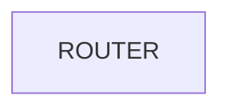
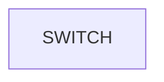
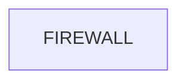

# CCNA Part 1

## Network devices:

### Network:

#### Offical Description:

* a digital telecommunications network which allows nodes to share resources.

#### Emre's Description:

* A traffic system that makes sure every node is cappable of sending things to eachother.

### Network Devices:

#### Offical Description:

*  a computer and networking device that forwards data packets between computer networks, including internetworks such as the global Internet.

#### Emre's Description:

* Roads inbetween cities

---

* Routers have fewer network interfaces than switches.

* Routers are used to provide connectivity between LANs.

* Routers are used to send data over the internet.

#### Offical Description:

* A network switch (also called switching hub, bridging hub, Ethernet switch, and, by the IEEE, MAC bridge[1]) is networking hardware that connects devices on a computer network by using packet switching to receive and forward data to the destination device.

#### Emre's Description:

* a traffic system that doesnt go outside of the city its in.

---

* Switches have many network interfaces/ports for end hosts to connect to (usually 24+).

* Switches provide connectivity to hosts within the same LAN

* Switches do not provide connectivity between LANs/over the internet.   

#### Offical Description:

* specialty devices that control network traffic entering and exiting your network.

#### Emre's Description:

* a guard that doesnt let bad packages in that might be attacting the host.

---

* Firewalls can be places outside of your router like FW1, or inside of your network like FW2.

* ASA5500-X(classic next generation firewall) and Firepower 2100(next generation firewall)

* Firewalls Monitor and control traffic based on configured rules.

* Firewalls can be placed 'inside the network' or 'outside the network'. in some cases it might be both.

* Firewalls are known as 'Next-Generation' when they include more modern and advanced filtering capabilities.

* Network firewalls are harware devices that filter traffic between network.

* Host based firewalls are software based firewalls that decide what is accepted into the host.

* inside the network means that the firewall can filter the traffic before it reaches the router and outside means the firewall can filter after it has passed through the router.

#### Offical Description:

* a device that provides functions or services for clients.

#### Emre's Description:

* a service that provides the service that is being asked

#### Offical Description:

* a device that accesses a service made available by a server.

#### Emre's Description:

* a device that asks for services from a server.

#### Side Notes:

* The same device can be a client in some situations and a server in other sitiations.

* Catalyst switches are ciscos enterprise level switches they are used to connect their LAN's

* ISR 1000 and 4000 have their network interfaces in the back.

#### Directory:

* LAN(Local Area Network) : End hosts with in the same area.
