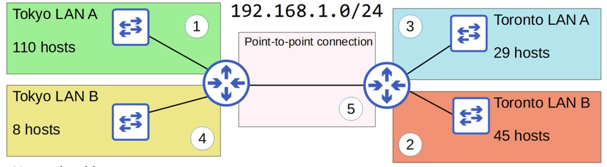

# CCNA Part 15

## VLSM (Variable Length Subnet Masks)

* Until now, we have practiced subnetting used FLSM(Fixed length Subnet Masks)

* This means that all of the subnets use the same prefix length

* VLSM is the process of creating subnets of diffrent sizes, to make your use of network addresses more efficent.

* VLSM is more complicated than FLSM, but it's easy if you follow the steps correctly.

#### Steps For VLSM

1) Assign the largest subnet at the start of the address space.

2) Assign the second-largest subnet after it.

3) Repeat the process until all subnets have been assigned.

#### Tokyo LAN A:

    Subnet Prefix: /25

    Network Address: 192.168.1.0/25

    Broadcast Address: 192.168.1.127/25

    First Usable Address: 192.168.1.1/25

    Last Usable Address: 192.168.1.126/25

    Total Number of Usable Host Addresses: 126

#### Toronto LAN B:

    Subnet Prefix: /26

    Network Address: 192.168.1.128/26

    Broadcast Address: 192.168.1.191/26

    First Usable Address: 192.168.1.129/26

    Last Usable Address: 192.168.1.190/26

    Total Number of Usable Host Addresses: 62

#### Toronto LAN A:

    Subent Prefix: /27

    Network Address: 192.168.1.192/27

    Broadcast Address: 192.168.1.223/27

    First Usable Address: 192.168.1.193/27

    Last Usable Address: 192.168.1.222/27

    Total Number of Usable Host Addresses: 30

#### Tokyo LAN B:

    Subnet Prefix: /28

    Network Address: 192.168.1.224/28

    Broadcast Address: 192.168.1.239/28

    First Usable Address: 192.168.1.225/28

    Last Usable Address: 192.168.1.238/28

    Total Number of Usable Host Addresses: 14

#### Point to Point connection

    Subnet Prefix: /30

    Network Address: 192.168.1.240/30

    Broadcast Address: 192.168.1.243/20

    First Usable Address: 192.168.1.241/30

    Last Usable Address: 192.168.1.242/30

    Total Number of Usable Host Addresses: 2

## Practice from following links

http://www.subnettingquestions.com/

http://subnetting.org/

https://subnettingpractice.com/

