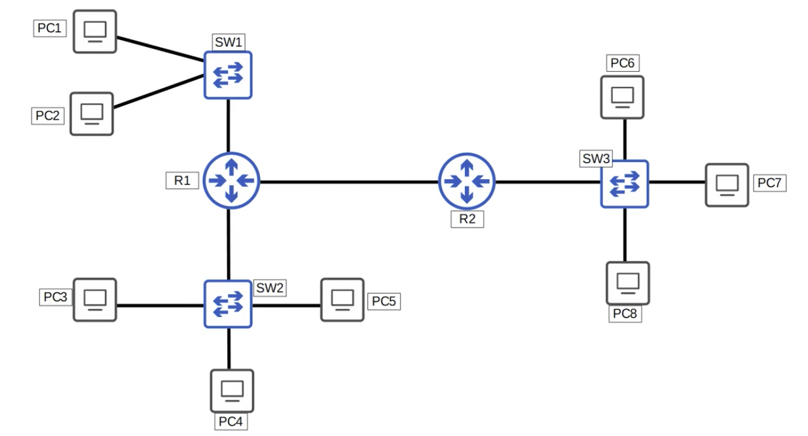
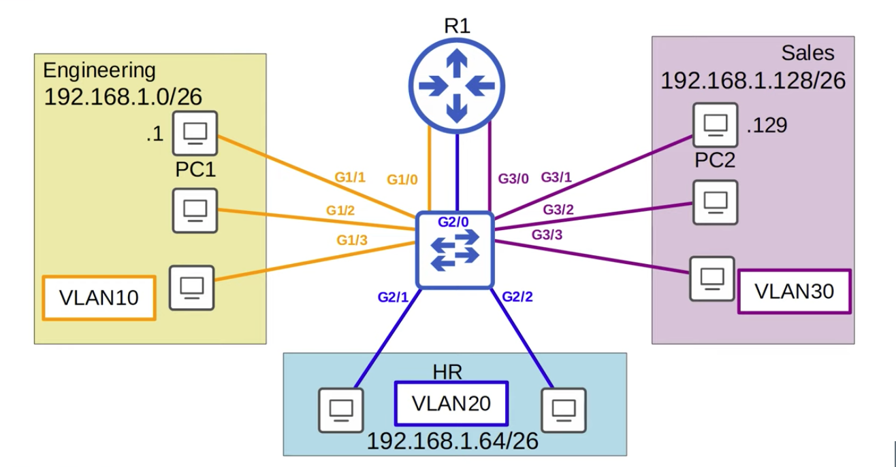

# CCNA Part 16

## VLANs Part 1

### Agenda

* What is a LAN?

* Broadcast Domains

* What is a VLAN?

* What is the purpose of VLANs?

* How to Configure VLANs on Cisco switches.

#### LAN:

* Previouslt said a LAN is a group of Devices in a single location.

* A more specific definition: A LAN is a single broadcast domain, including all devices in that broadcast domain.

* A broadcast domain is the group of devices which will receive a Broadcasr frame send by anyone of the members.

---

#### How many broadcast domains are there?

* 4 Broadcast domains 

    * (PC1, PC2, R1 int), (PC3, PC4, PC5, R1 int), (PC6, PC7, PC8, R2 int) (R1 int, R2 int)

---

#### VLAN:

* Can Divide up LANs for broadcasting is made more specific.

* Performece can be hinder in larger LANs due to uncexessary Broadcast Traffic.

* Security is also a concern, A VLAN helps limit who has access to what. you can apply security policies on a router/firewall.

    * Beacuse in a LAN all hosts can reach eachother directly through the router, so even if the router has security policies it wont matter withing the LAN.

* You can configure the VLANs on the switch. this will make it so that broadcasting will only flood the same VLAN ports

* VLANs are configured on switches on a per-interface basis.

* logically separate end hosts at layer 2.

* The way to setup VLANs:

    1) Divide the LAN to desired number of subnets.

    2) Connect the switch to the router in separate interfaces for each VLAN

    3) Configure VLAN Through the switch

* by default all ports are under VLAN 1

#### How to Assign Interfaces to VLANs

1) `interface range interface-nums`

2) `switchport access vlan VLAN-num`

* An <b>access port</b> is a switchport which belongs to a single VLAN, and usually connects to the end hosts like PCs.

* Switch ports which carry multiple VLANs are called <b>Trunk Ports</b>

* `vlan VLAN-num` - to config VLAN(This command creates a VLAN).

* `name VLAN-name` - to assign name to VLAN.

* 5 VLANs are there in the Switch by default

    * VLAN 1 Default

    * VLAN 1002 FDDI-deafult

    * VLAN 1003 token-ring-default

    * VLAN 1004 fddinet-default

    * VLAN 1005 trnet-default