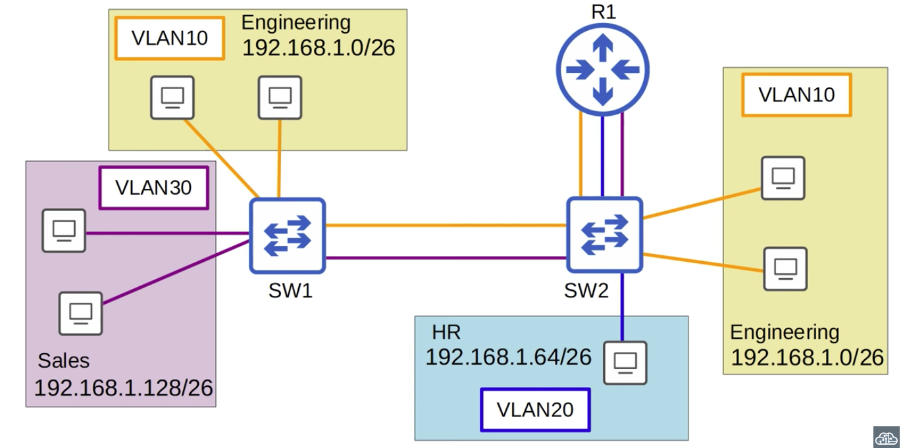
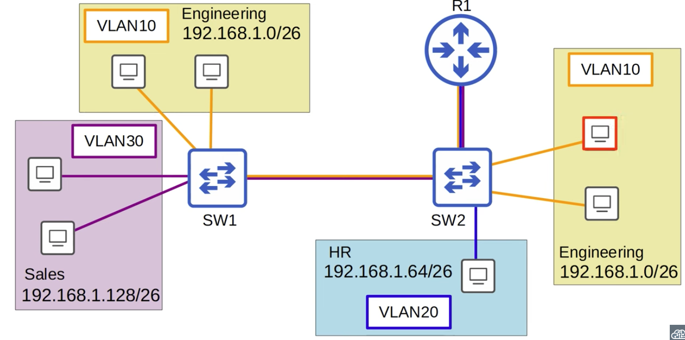
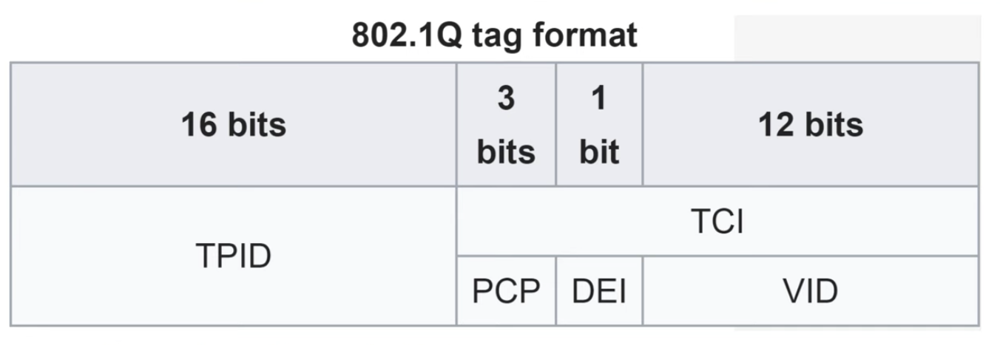

# CCNA Part 17

## VLANs Part 2

### Agenda

* What is a Trunk Port?

* What is the purpose of trunk ports?

* 802.1Q Encapsulation

* How to configure trunk ports

* 'Router on a Stick' (ROAS)

### Network topology used for these notes.

* In a Small network with few VLANs it is possible to use a separate interface for each Vlan when connecting switches to routers.

* However, when the Number of VLANs increases, this is not viable. It will result in wasted interfaces, and often routers won't have enough interfaces for each VLAN

* Trunk ports can be used to carry traffic from multiple VLANs over a single interface.

### Same Network Using Trunk Ports.

* above is the same network using Trunk Ports.

* Switches will 'tag' all frames that they send over a trunk link.

* Tagging is how the receiving switches know which VLAN the frame belongs to.

* Trunk port = 'tagged' ports / Access ports = 'untagged' ports

#### VLAN Tagging

* There are two main trunking protocols: ISL(Inter-Switch Link) and IEEE 802.1Q(dot1q)

* ISL is an old Cisco proprietary protocol created before the industry standart dot1q.

* IEEE 802.1Q is an industry standart protocol created by the IEEE.

* You will never need ISL in the real world.

#### 802 .1Q Tag

* The 802.1Q tag is inserted between the source and the type/length firelds of the ethernet frame.

* The tag is 4 bytes (32 bits) in length.

* The tag consists of two main fields:

    * Tag Protocol Identifier(TPID).

    * Tag Control Information (TCI).

* The TCI consists of three sub-fields.

    * PCP

    * DEI

    * VID

#### TPID

* 16 bits in length.

* Always set to 0x8100. This indicates the frame is 802.1Q tagged.

#### TCI-PCP(Priority Code Point)

* 3 bits in length.

* Used for Class of Service (Cos), which prioritizes important traffic congested networks.

#### DEI (Drop Eligiable Indicator)

* 1 bit in length.

* Used to indicate frames that can be dropped if the network is congested.

#### VID (VLAN ID)

* 12 bits in length.

* Identifes the VLAN the frame belongs to.

* the number of usable address' is 2^12 - 2 = 4094

* 0 and 4096 are reserved and can't be used

* Cisco ISL also has a VLAN range of 1-4094

#### VLAN Ranges:

* The range of VLANs (1-4094) is devided into two sections:

    * Normal VLANs: 1 - 1005

    * Extended VLANs: 1006 - 4094

* Some older devices cannot use the extended VLAN range, however it's safe to expect that modern switches will support the extended VLAN range.

#### Naitive VLAN

* 802.1Q has a feature called the native VLAN(ISL doesnt have it)

* The Naitive VLAN is VLAN 1 by default on all trunk ports, however this can be manually configured on each trunk port.

* The switch doe not add an 802.1Q tag to frames in the Native VLAN.

* When the switch recieves an untagged frame on a trunk port, it assumes the frame belongs to the naitive VLAN. It is very improtant that the naitive VLAN Matches.

#### Configuration of trunk ports.

1) `interface interface`

2) `switchport trunk encapsulation dot1q`

3) `switchport mode trunk` 

* `show interfaces trunk` - to show trunk interfaces.

    * Port : Interface.

    * Mode: on means manually done

    * Encapsulation: type of encapsulation used (EX.802.1Q).

    * Status: trunking

    * Naitive VLAN: 1

* `switchport trunk allowed vlan ?`

    * `WORD`: Config the list of VLANS allowed

        * EX: `switchport trunk allowed vlan 10, 30`

        * Only allows VLANs 10 and 20 on the trunk

    * `add`: add Vlans to the current list.

        * EX: `switchport trunk add 20`

        * allows VLAN 20 on the trunk. 

    * `remove`: removes VLAN from the current list.

    * `all`: adds all VLANns to the current list.

    * `expcet`: adds all VLANs except the ones states.

    * `none`: removes all from the list.

---

* For network services it is best to change the naitive VLAN to an unused VLAN.

* `switchport trunk naitive vlan naitive-vlan-num` - this changes the naitive VLAN.

#### Router on a Stick (ROAS)

* Used to route between multiple VLANs using a single interface on the router and switch.

* The switch interface is configured as a regular trunk.

* The router interface is configured using subinterfaces. You configure the VLAN tag and IP address on each subinterface.

* The router will behave as if frames arrivinf with certain VLAN tag have arrived on the subinterface configured with that VLAN tag.

* The router will tag frames sent out of each subinterface with the VLAN tag configured on the subinterface.

* On the switch all you have to do is configure the interface as a trunk.

* Configuration of the router is as follows:

    1) `interface 'interface'`

    2) `no shutdown`

    3) `interface 'sub-interface'`

    4) `encapsulation 1dotq 'VLAN-num'`

    5) `ip address 'ip-address' 'netmask'`

    6) Change subinterface and repeat.
