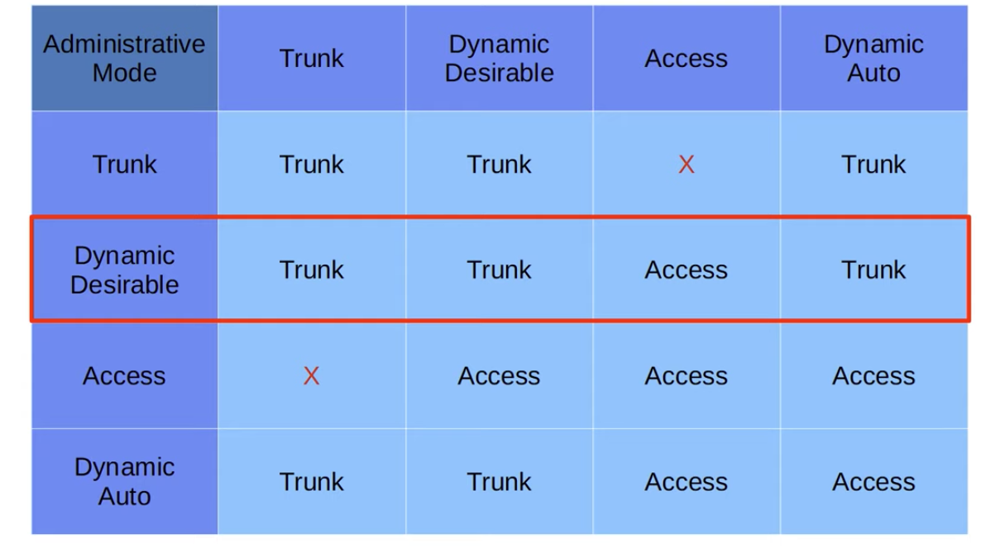

# CCNA Part 19

## DTP(Dynamic Trunking protocol), VTP(VLAN trunking protocol)

* DTP and VTP were removed from the CCNA Howver its still important to know

### Agenda

* DTP.

* VTP.

#### DTP:

* DTP is a cisco proprietary protocol that allows Cisco Switches to dynamically determine their interface status(access or trunk) without configuration.

* DTP is enabled by default on all Cisco switch interfaces.

* So far we have been manuallu configuring switchports using these commands

    * `switchport mode access` or `switchport mode trunk`

* For security perposes, manual configuration is recoomended. DTP should be disabled on all switchports.

* In order to activate DTP use command `switchport mode dynamic auto` or `switchport mode dynamic desirable`

    * A switchport in dynamic desirable mode will actively try to form a trunk with other Cisco switches. It will form a trunk if connected to another switchport in the following modes:

        * switchport mode trunk

        * switchport mode dynamic desirable

        * switchport dynamic auto.

    * A switchport in dynamic auto mode will not actively try to form a trunk with other Cisco switches, however it will form a trunk if the switch connected to it is trying to form a trunk. It will form a trunk with a switchport in the following modes:

        * switchport mode trunk

        * switchport mode dynamic desirable

* On older switches, switchport mode dynamic desirable is the default administrative mode.

* On newer switches, switchport mode dynamic auto is the default administrative mode.

* You can disable DTP negotiation on an interface with this command: `switchport nonegotiate`

* Configuring an access port without switchport access also disables DTP negotiation on an interface.

* Switches that support both 802.1Q and ISL trunk encapsulations can use DTP to negotiate the encapsulation they will use.

* This negotiation is enabled by default, as the default trunk encasulation mode is: switch port trunk encapsulation negotiate

* ISL is favoired over 802.1Q, so if both switches support ISL it will be selected.

* STP frames are sent in VLAN1 When using ISL, or in the native VLAN when using 802.1Q(the default native VLAN is VLAN1, however).

#### VTP(VLAN Trunking Protocol):

* VTP allows you to configure VLANs on a central VTP server switch, and other switches(VTP clients) will synchronize their VLAN database to the server.

* It is designed for large networks with many VLANs, so that you dont have to configure each VLAN on every switch.

* It is rearly used, and it is reccommended that you do not use it.

* There are three VTP versions: 1, 2, and 3.

* There are three VTP modes: server, client, and transparent.

* Cisco switches oparate in VTP server mode by default.

* VTP Servers:

    * Can add/modify/delete VLANs.

    * Store the VLAN database in a non-volatile RAM(NVRAM).

    * Will increase the revision number every time a VLAN is added/modified/deleted.

    * will advertize the latest version of the VLAN database on trunk interfaces and the VTP client will synchronize their VLAN database to it.

    * VTP servers also function as VTP Clients

        * Therefore, a VTP server will sync to another VTP server with higer revision number.

* VTP Clients:

    * Cannot add/modify/delete VLANs.

    * DO not store the VLAN database in NVRAM. (in VTPv3 they do)

    * Will sync their VLAN database to the server with the highest revision number in their VTP domain.

* VLAN Transparent mode:

    * Does not participate in the VTP domain(does not sync its VLAN database).

    * Maintains its own VLAN database in NVRAM. it can add/modify/delete VLANs, but they wont be advertised to other switches.

    * Will forward VTP advertisements that are in the same domain as it.

* Changing the VTP domain to an unused domain will reset the revision number to 0.

* changing the VTP mode to transparent will also reset the revision number to 0.

* To change VTP version use command `vtp version 2`

