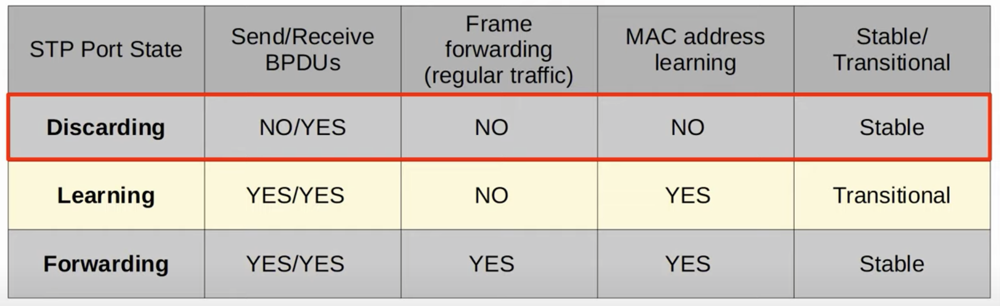

# CCNA Part 22

## Rapid STP

### Agenda:

* Comparison of STP version(Standart vs Cisco)

* Rapid PVST+

### Spanning Tree Versions

#### Industry Standart(IEEE):

* Spanning Tree Protocol (802.1D)

    * The original STP

    * All VLANs share one STP instance.

    * Therefore, cannot load balance.

* Rapid Spanning Tree Protocol (802.1w)

    * Much faster at converging/adapting to network changes than 802.1D.

    * All VLANs share one STP instance.

    * Therefore, cannot load balance.

* Multiple Spanning Tree Protocol (802.1s)

    * Uses modified RSTP mechanics.

    * Can group multiple VLANs into diffrent instences to perform load balancing.

#### Cisco Version:

* Per-VLAN Spanning Tree Plus (PVST+)

    * Cisco's upgrade to 802.1D

    * Each VLAN has its own STP instence.

    * Can load balance by blocking diffrent ports in each VLAN.

* Rapid Per-VLAN Spanning Tree Plus (Rapid PVST+)

    * Cisco's upgrade to 802.w

    * Each VLAN has its own STP instance.

    * Can load balance by blocking diffrent ports in each VLAN.

### Rapid Spanning Tree Protocol

* Cisco Summary:

    * RSTP is not a timer-based spanning tree algo like 802.1D. Therefore, RSTP offers an improvement over the 30 seconds or more that 802.1D takes to move a link to forwarding. The heart of the protocol is a new bridge handshake mechanism, which allows ports to move directly to forwarding.

* Similarities between STP and RSTP:

    * RSPT serves the same purpose as STP, blocking specific ports to prevent Layer 2 loops.

    * RSTP elects a root bridge with the same rules as STP.

    * RSTP elects root ports with the same rules as STP.

    * RSTP elects designated ports with the same rules as STP.

* Diffrences Between STP and RSTP:

    * Port costs were updated in RSTP as follows.
        
        * 10 Mbps: 2000000

        * 100 Mbps: 200000

        * 1 Gbps: 20000

        * 10 Gbps: 2000

        * 100 Gbps: 200

        * 1 Tbps: 20

        * 10 Tbps: 2

    * RSTP combines Blocking and Disabled state into one state called Discarding state and doesn't use the Listening state.

        * 

        * If a port is administratively disabled (shutdown command) = Discarding State(prev. Disabled state)

        * If a port is enabled but blocking traffic to prevent Layer 2 loops = Discarding State(prev. Blocking State)

    * The nondesignated port role is split into two separate roles in RSTP:

        * The alternate port role:

            * A discarding port that recieves a superior BPDU from another Switch.

            * This is the same as what youve learned about blocking ports in classic STP.

            * Functions as a backup to the root port.

            * If the root port fails, the switch can immidiatly move its best alternate fort ro forwarding.

            * Uplink Fast is how you would do this in a regular STP.

        * The backup port role:

            * A discarding port that receives a superior BPDU from another interface on the same switch.

            * This only happens when two interfaces are connected to the same collision domain(via a hub)

            * Function as a backup for a designated port.

            * The Interface with the lowest port ID will be selected as the designated port, and the other will be the backup port.

* Uplink Fast/BackboneFast Summary

    * Both used to help blocking/discarding ports rapidly mode to forwarding.

    * Both features are built into RSTP so no config needed.

* Inorder to tunr on rapid PVST use command `spanning-tree mode radif-pvst`

* Rapid STP is compatible with Classic STP. The interfaces on the Rapid STP-enabled switch connected to the Classic STP-enabled switch will oparate in Classic STP mode.

* Rapid Spanning Tree BPDU:

    * Protocol Versions:

        * 0 for classic STP

        * 2 for rapid STP

    * BPDU Flags:

        * Classic STP only has two flags(2 bits):

            * Topology Change Acknowledgment

            * Topology Change

        * Rapid STP has 7 flags(8 bits):

            * Topology Change Acknowledgment

            * Agreenment

            * Forwarding

            * Learning

            * Port Role(2 bits)

            * Proposal

            * Topology Change

* In classic CTP only the root bridge originated BPDUs and other switches just forwarded the BPDUs they recieves. In Rapid STP All switches originate and send their own BPDUs from designated ports.

* All switches running Rapid STP send their own BPDUs every hello time(2 seconds).

* Switches 'age' the BPDU information much more quickly. In classic STP, a switch waits 10 hello intervals(20 seconds). In rapid STP, a switch considers a neighbor lpost if it misses 3 BPDUs(6 seconds). It will then 'flush' MAC addresses learned on that interface.

* RSTP Link Types:

    * EDGE: a port that is connected to an end host. Moves directly to forwarding, without negotiation.

        * Connected to end hosts.

        * No risk of createing a loop so can transition straight to the forwarding state.

        * They function like a classic STP port with Portfast enabled.

    * P2P(Point to Point): a direct connection between two switches.

        * Connects directly to another switch.

        * They Function in full duplex

        * you dont need to configure this

    * SHARED: a connection to a hub. Must oparate in half-duplex mode.

        * They function in half-duplex

        * no need to configure.
        
