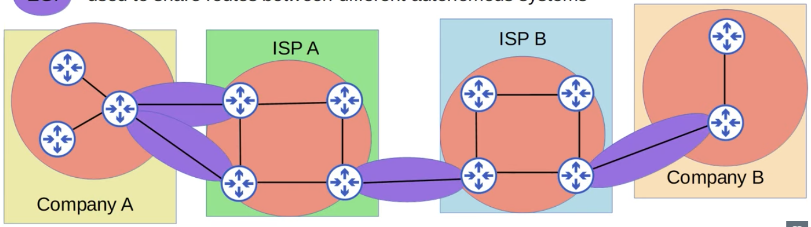
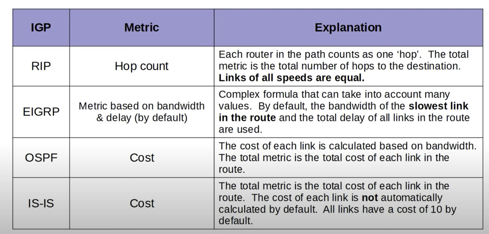
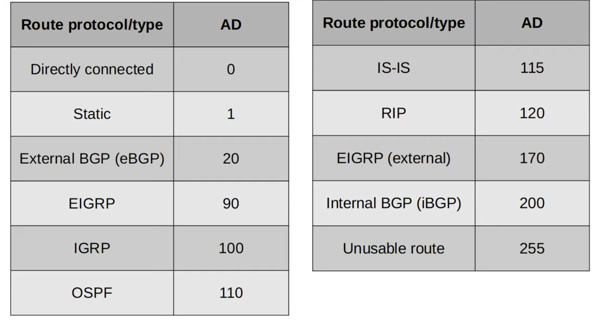

# CCNA Part 24

## Dynamic Routing

### Agenda

* Introduction to dynamic routing protocols

* Types of dynamic routing protocols

* Dynamic routing protocol metrics

* Administrative distance

#### Dynamic Routing

* Network route: A route to a network or subnet(mask length < /32).

* Host route: A route to a specific host(/32 mask).

* Dynamic routing is very useful when it is needed for making sure the network stays upto date with outages and new routes getting added.

* Dynamic routing use a similar algo to STP when there are redundant connections.

* Routers can use dynamic routing protocols to advertise information about the routes they know to other routers.

* They form 'adjecencies'/'neighbor relationships'/'neighborships' with adjecent routers to exchange this information.

* If multiple routes to a destination are learned, the router determines which route is superior and adds it to the routing table. it uses the 'metric' of the route to decide which is superior(lower metric = superior).

#### Types of Dynamic Routing Protocols

* Dynamic routing protocols can be devided into two main catagories:

    * IGP (Interior Gateway Protocol):

        * Used to share routes within a single autonomous system(AS), which is a signle organisation(ie. a company)

    * EPG (Extirior Gateway Protocol):

        * Used to share routes between diffrent autonomous systems.

* The red circles are IGP and the Purple Circles are EGP.

#### IGP Algos

* Distance Vetor

    * RIP(Routing Information Protocol)

    * EIGRP(Enhanced Interior Gateway Routing Protocol)

* Link State

    * OSPF(Open Shortest Path First)

    * IS-IS(Intermediate System to Intermediate Sytem)

#### EGP Algos

* Path Vactor

    * BGP(Border Gateway Protocol)

#### Distance Vector Routing Protocols

* Distance vector protocols were invented before link state protocols.

* Early examples are RIPv1 and Cisco's proprietary protocol IGRP(Which was updated to EIGRP)

* Distance vector protocols oparate by sending the following to their directly connected neighbors:

    * Their known destination networks

    * their metric to reach their known destination networks.

* This method of sharing route information is often called 'routing by rumor'

* This is because the router doesn't know about the network beyond its neighbors. It only knows the information that its neighbors tell it.

* Called 'distance vector' because the routers only learn the 'distance' (metric) and 'vector' (direction the next hop router) of each route.

#### Link State Routing Protocol

* When using a link state routing protocol, every router creates a 'connectivity map' of the network.

* To allow this, each router advertises information about its interfaces(connected networks) to its neighbors. These advertisements are passed along to other routers, until all routers in the network develop the same map of the network.

* Each router independently uses this map to calculate the best routes to each destination.

* Link state protocols use more resources(CPU) on the router, because more information is shared.

* However, link state protocols tend to be faster in reacting to changes in the network than distance vector protocols.

#### Dynamic Routing Protocol Metrics

* A router's route table contains the best route to each destination network it knows about.

* If a router using a dynamic routing protocol learn two diffrent routes to the same destination,how does it determine which is best?

    * it uses the metric value of the routes determine which is best. A lower metric == better.

* each routing protocol uses a diffrent metric to determine whihc rout is the best.

* If a router learns Two or more routes via the same routing protocol to the same destination(Same network address, same subnet mask) with the same metric, both will be added to the routing table. Traffic will be loadbalanced over both routes.

* ECMP(EQUAL COST MULTI-PATH)

#### Administrative Distance

* In most cases a company will only use a single IGP - usally ospf or EIGRP.

* However, in some rare casses they might use two. For example, if two companies connect their networks to share information, two diffrent routing protocols might be in use.

* Diffrent routing protocols use totally diffrent metrics, so they cannot be compared

* the administrative distance(AD) is used to determine which of the routing protocol is prefered.

* The lower AD is preffered, and indicated that the routing protocol is considered more 'trustworthy' (more likely to select good routes).

* If the administrative distance is 255, the router does not believe the source of the route and does not install the route in the routing table.

* You can change the AD of a routing protocol.

* You can also change the AD of a static route.

#### Floating Static Routes

* By changing the AD of a static route you can make it less prefered.

* This is called a floating static route.

* The route will be inactive(not in the routing table) unless the route learned by the dynamic routing protocol is removed(for example, the remote router stops advertising it for some reason, or an interface failure cases ab adjecency with a neighbor to be lost).
