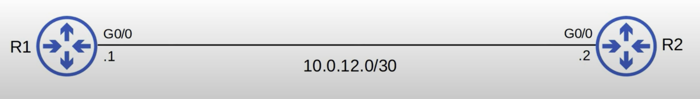
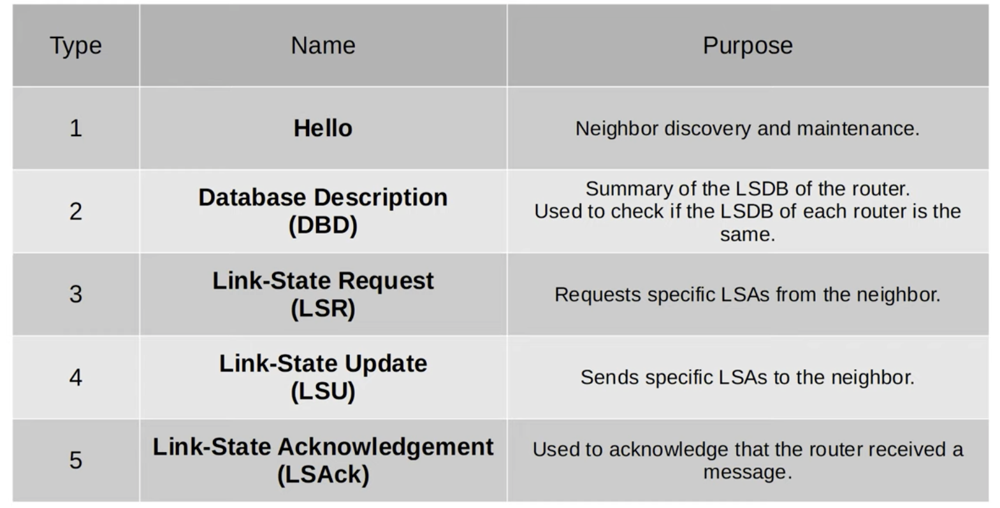

# CCNA Part 27

## OSPF Part 2

### Agenda

* OSPF metric(cost)

* Becoming OSPF neighbors

* More OSPF configurations

#### OSPF Cost

* OSPF metric is called cost

* It is automatically calculated based on the bandwidth of the interface.

* The default reference bandwidth is 100 mbps.

    * 10 mbps = 10

    * 100 mbps = 1

* Any value less than 100 mbps is cost 1.

* The dault situation is not ideal however it can be changed by using the following command.

    * `auto-cost reference-bandwidth MEGABITS-PER-SECOND`

    * You should set this number a number thats faster than the fastest bandwidth in your network.

    * you have to do this in every OSPF router.

* The OSPF cost to a destination is the total cost of the 'outgoing/exit interfaces'.

* Loopback interfaces have a cost of 1.

* `ip ospf cost COST` to manually configure the ospf cost. Configured directly on the interface.

* There is anotother way to change the OSPF cost by changing bandwidth.

    * The formula to calculate OSPF cost is reference bandwidth/interface bandwidth

    * Although the bandwidth matches the speed by default changing the bandwidth will not have any effect on the speed.

    * bandwidth is used more for calculations.

    * However it is still not recomemnded to change the bandwidth since other calculations are done with it as well.

    * `bandwidth BANDWIDTH` is how you change the bandwidth in kilobits.

* Three ways to modify the OSPF cost:

    1) Change the reference bandwidth:

        * `auto-cost reference-bandwidth MEGABITS-PER-SECOND`

    2) Manual configuration:

        * `ip ospf cost COST`

    3) Change the interface bandwidth(NOT RECCOMENDED)

        * `bandwidth KILOBITS-PER-SECOND`

* `show ip ospf brief` - show ospf interfaces including cost.

#### OSPF Neighbors

* Making sure that routers successfully become OSPF neighbors is the main task configuring and trubleshooting OSPF.

* Once routers become neighbors, they aoutomatically do the work of sharing network information, calculating routes, etc.

* When OSPF is activated on an interface the router starts sending OSPF hello messafes out of the interface at regular intervals(determined by hello timer). These are used to intraduce the router to potential OSPF neighbors.

* The default hello ti,er is 10 seconds on an Ethernet connection.

* Hello messages are multicast to 224.0.0.5.

* OSPF messages are encapsulated in an IP header, with a value of 89 in the protocol field.

* Down State:

    * OSPF is activated on R1's G0/0 interface.

    * It sends an OSPF hello message to 224.0.0.5

    * R1 doesnt know about any OSPF neighbors so the current neighbor state is down.

    * When R2 recieves the hello message it will put down R1 as its OSPF neighbor.

* Init state:

    * Hello packet recieved, but own router ID is not in the hello packet.

* Two Way State:

    * R2 will send a hello packet containing the RID of both routers. R1 will insert R2 into ots OSPF neighbor table in a 2-way state.

    * R1 will send another hello message, this time containing R2's RID. Now both routers are in the 2-Way state.

    * The two way state means the router has recieved a Hello packet with its own RID in it.

    * If both routers reached the 2-way state, it means that all the conditions have been met for them to become OSPF neighbors. They are now ready to share LSAs to build a common LSDB.

    * In some network types, a DR(designated Router) and a BDR(Backup Designated Router) will be elect at this point.

* Exstart State:

    * The two routers will now prepare to exchange information about their LSDB.

    * Before that, they have to choose which one will start the exchange.

    * They do this in the Exstart state.

    * The router with the higher RID wi;; become the master and initiate the exchange. The router with the lower RID will become the slave.

    * To decide Mater and slave they exchange DBD(Database Description) packet

* Exchange State:

    * The routers exchange DBDs which contain a list of LSAs in their LSDB.

    * These DBDs do not include detailed information about the LSAs, Just basic info.

    * The routers compare the information in the DBD they recieve to the information on their own LSDB to determine which LSAs they must recieve from their neighbor.

* Loading State:

    * In the Loading state, routers send Link State Request(LSR) messages to request that their neighbors send them any LSAs they dont have.

    * LSAs are sent in the Link State Update (LSU)  messages.

    * The routers send LSAck messages to acknolage that they recieved the LSAs.

* Full State:

    * In the Full state, the routers have a full OSPF adjecency and identical LSDBs.

    * They continiue to send and listen for Hello packets(every 10 seconds by default) to maintain the neighbor adjacency.

    * If the Dead timer counts down to 0 and no hello message is received, the neighbor is removed.

    * The routers will continue to share LSAs as the network changes to make sure each router has a complete and accurate map of the network(LSDB).

#### More OSPF Configurations

* `show ip ospf neighbor` - show neighbors

* `show ip ospf interface` - hows ospf interface info

* `ip ospf PROCESS-ID area AREA` - activates ospf directly on the interface.

* `passive-interface default` - Configures all interfaces as OSPF passive interfaces.

