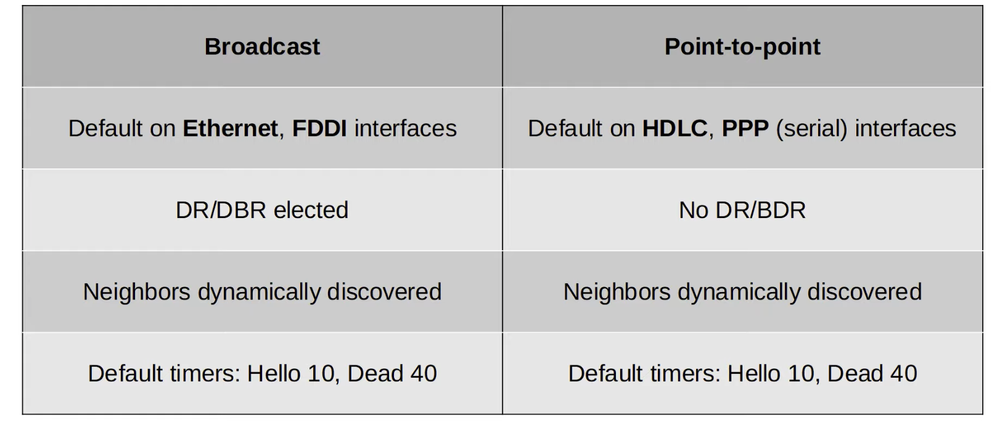

# CCNA Part 28

## OSPF Part 3

### Agenda

* OSPF network types.

* OSPF neighbor/adjecency requirments.

* OSPF LSA types.

#### Loopback Interfaces

* A loopback address is a virtual interface in the router.

* It is always up/up(unless manually shutdown).

* It is not dependednt on a physical interface.

* So, it provides a consisitent IP address that can be used to reach/identify the router.

#### OSPF Network Type

* The OSPF 'network type' refers to the type of the connection between OSPF neighbors(Ethernet, etc)

* There are three main OSPF network types:

    * Broadcast: Enabled by deafult on Ethernet and FDDI(Fiber Distributed Data Interfaces) interfaces.

    * Point-to-Point: Enabled by default on PPP(Point-to-Point Protocol) and HDLC(High-Level Data Link) interfaces.

    * Non-Broadcast: Enables by deafult on Frame Relay and X.25 interfaces.

#### Boradcast Network Type:

* Enabled on Ethernet and FDDI interfaces by default.

* Routers dynamically discover neighbors by sending/listening for OSPF Hello messages using multicast address `224.0.0.5`.

* A DR(designated router) and BDR(backup designated router) must be elected on each subnet(only DR if there are no OSPF neighbors).

* Routes which aren't DR or BDR become DROther.

* DR/BDR election priority:

    1) Higest OSPF interface priority.

    2) Highest OSPF Router ID.

* 'First Place' becomes the DR for the subnet, 'Second Place' become the BDR.

* The default OSPF interface priority is 1 on all interfaces.

* `ip ospf priority PRIORITY` to change interface ospf priority.

* DR/BDR election is 'non-preemptive'. Once the DR/BDR are selected they will keep their role until OSPF is reset, the interface fails/is shut down, etc.

* When the DR goes down, the BDR becomes the new DR. Then an election is held for the next BDR.

* DROther will only move to the FULL state with the DR and BDR. The neighbor state with other DROthers will be 2-way.

* In the broadcast network type, routers will only form a full OSPF adjecency with the DR and BDR of the segment.

* Therefore, routers only exchange LSAs with DR and BDR. DROthers will not exchange LSAs with each other.

* All routers will still have the same LSDB, but this reduces the amount of LSAs flooding the network.

* Messages to DR/BDR are multicast using address `224.0.0.6`.

* DR and BDR will form a full adjecency with all the routers in the subnet; However the DROthers will form a full adjecency only with DR and BDR.

#### Point-to-Point Network Type:

* Enabled on serial interfaces using the PPP or HDLC encapsulation by default.

* Routers dynamically discover neighbors by sending/listening for OSPF Hello messages using multicast address `224.0.0.5`.

* A DR and BDR are not elected

* These encapsulations are used for 'point-to-point' connections, therefore there is no need to elect a DR and BDR.

* The two routers will form a Full adjacency with each other.

* Serial Connections:

    * One side of a serial Connection functions as DCE(Data Communication Equipment).

    * The other side functions as DTE(Data Terminal Equipment).

    * The DCE side needs to specify the clock rate(speed) of the connection.

    * Ethernet interfaces use the `speed` command to configure operating speed. Serial interfaces use the `clock rate` command instead.

    * `encapsulation ppp` - change to ppp encapsulation.

    * Must change both interfaces or the interface connectivity will go down. 

* Serial Interfaces:

    * The default encapsulation on a serial interface is HDLC.

    * You can configure PPP encapsulation with command `encapsulation ppp`

    * One side is DCE, one side is DTE.

    * Identify which side is DCE/DTE `show controllers INTERFACE-ID`

    * You must configure the clock rate on the DCE by command `clock rate BITS-PER-SECOND`

* `ip ospf network NETWORK-TYPE` to change the ospf network type.

#### OSPF neighbor Requirments

* OSPF areas must match.

* The interfaces must be in the same subnet.

* OSPF process must not be shutdown.

* OSPF router IDs must be unique.

* Hello and Dead timers must match.

* Authentication setting must match.

* IP MTU settings must match(Can become OSPF neighbors however they wont function properly)

* OSPF network type must match

#### LSA Types

* Type 1(Router LSA)

    * Every OSPF router generates this type of LSA.

    * It identifies the router using its router ID.

    * It also lists networks attached to the router's OSPF-activated interfaces.

* Type 2(Network LSA)

    * Generated by the DR of each 'multi-access' network

    * Lists the routers which are attached to the multi-access network.

* Type 5(AS External LSA)

    * Generated by ASBRs to describe routes to destinations outside of the AS(OSPF domain).