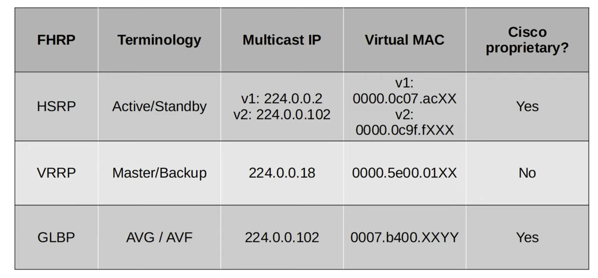

# CCNA Part 29

## First Hop Redundency Protocol

### Agenda

* The purpose of FHRPs

* HSRP(Hot Standby Router Protocol)

* VRRP(Virtual Router Redundancy Protocol)

* GLBP(Gateway Load Balancing Protocol)

#### The Purpose of FHRPs

* A first hop redundancy protocol(FHRP) is a computer networking protocol wich is designed to protect the default gateway used on a subnet by allowing two or more routers to provide backup for that address; in the event of a failure of an active router, the backup router will take ober the address, usually within a few seconds.

* A Virtual IP(VIP) is used.

* Gratuitous ARP: ARP replies sent without being requested. These frames are broadcast to `FFFF.FFFF.FFFF`

* FHRPs are 'non-preemptive'

* A virtual IP is configured on the two routers, and a virtual MAC is generated for virtual IP.

* An active router and a standby router are elected.

* End hosts in the network are configured to use the virtual IP as their default gateway.

* The actice router replies to ARP request using the virtual MAC address, so traffic destined for other networks will be sent to it.

* If the active router fails the standby router will send a gratuitous ARP so the switches will update their MAC tables and it will now become the Active router.

* if the ex-active router comes back online it will no longer be the active router and will just become a backup router.

* You can however configure so that the ex-active router becomes the active router again once active.

#### HSRP

* Cisco Proprietary.

* An active and standby router are elected.

* There are two versions: v1 and v2. V2 adds IPv6 support and increases the number of groups that can be formed.

* Multicast IPv4 address: v1 = `224.0.0.2` /  v2 = `224.0.0.102`

* Virtual MAC addresses: v1 = `0000.0c07.acXX` (`XX` = HSRP Group Number) / v2 = `0000.0c9f.fXXX`(`XXX` = HSRP Group Number)

* In a situation with multiple subnets/VLANs, you can configure a diffrent active router in each subnet/VLAn to load balance.

#### VRRP

* Open standart.

* A master and backup router elected.

* Multicast IPv4 address: `224.0.0.18`

* Virtual MAC address: `0000.5e00.01XX`(`XX` = VRRP Group Number)

* In a situation with multiple subnets/VLANs, you can configure a diffrent master router in each subnet/VLAN to loadbalance.

#### GLBP

* Cisco Proprietary

* Load Balances among multiple routers within a single subnet

* An AVG(Active Virtual Gateway) is elected.

* Up to four AVFs(Active Virtual Forwarders) are assigned by the AVG.

* Each AVF acts as the default gateway for a portion of the hosts in the subnet.

* Multicast IPv4 address: `224.0.0.102`.

* Virtual MAC address: `0007.b400.XXYY`(`XX` = GLBP group num, `YY` = AVF number).

