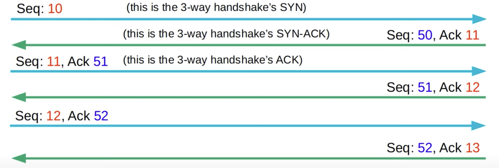

# CCNA Part 30

## TCP & UDP

### Agenda

* Basics of Layer 4.

* TCP(Transmission Control Protocol).

* UDP(User Datagram Protocol).

* Comparing TCP & UDP

#### Functions of Layer 4

* Provides transparent transfer of data between end hosts.

* Privides (or doesnt provide) various services to applications:

    * Reliable data transfer

    * Error Recovery

    * Data Sequencing

    * Flow control

* Provides Layer 4 addressing(port numbers).

    * Identify the Application Layer protocol.

    * Provides session multiplexing.

    * The following ranges have been designated by IANA(Internet Assigned Numbers Authority)
        
        * Well-Known port numbers: 0-1023

        * Registered port numbers: 1024-49151

        * Ephemeral/private/dynamic port numbers: 49152-65525 

* Session: an exchange of data between two or more communicating devices.

* Destination port: identifies the Application Layer protocol.

* Randomly selected by PC1, helps identify the session.

* TCP 80 = HTTPS

* TCP 21 = FTP(File Transfer Protocol)

#### TCP(Transmission Control Protocol)

* TCP is connection-oriented.

    * Before actually sending data to the destination host, the two hosts communicate to establish a connection. Once the connection is established, the data exchange begins.

* TCP provides reliable communication.

    * The Destination host must acknowledge that it recieved each TCP segment.

    * If a segment isn't acknowlaged, it is sent again.

* TCP provides sequencing.

    * Sequance numbers in the TCP header allow destination hosts to put segments in the correct order even if they arrive out of order.

* TCP provides Flow Control.

    * The destination host can tell the source host to increase/decrease the rate that data is sent.

* TCP Header:

    * Source and Destination port:

        * both 16 bits.

        * 2^16 available port numbers.

    * Sequance and Acknowledgment number:

        * both 32 bits.

        * Provide sequancing and reliable communication.

    * ACK SYN FIN Flags:

        * each 1 bit.

        * Used to establish and terminate connections.

    * Window Size:

        * 16 bits.

        * Used for flow control.

* Three-way Handshake.

    * Uses ACK and SYN flags.

    1) Device 1: Send TCP with SYN flag set.

    2) Device 2: Send TCP with SYN and ACK flag set.

    3) Device 1: Send TCP with ACK flag set.

    * This estanblished the connection

* Four-way Handshake.

    * Uses ACK and FIN flags.

    1) Device 1: Send TCP with FIN flag set.

    2) Device 2: Send TCP with ACK flag set.

    3) Device 2: Send TCP with FIN flag set.

    4) Device 1: Send TCP with ACK flag set.

    * This terminates the connection.

* Sequencing / Acknowledgment

* Window Size:

    * Acknowledging every signle segment, no matter what size, is inefficent.

    * The TCP headers Window Size field allows more data to be sent before an acknowledgment is required.
    
    * A 'sliding window' can be used to dynamically adjust how large the window size is.

#### UDP(User Datagram Protocol)

* Not connection oriented

    * The sending host does not establish a connection with the destination host before sending data. The data is simply sent.

* Does not provide reliable communication.

    * When UDP is used acks are not sent from the reciever. If a segment is lost it is lost. segments are sent 'best effort.

* Does not provide sequencing.

    * UDP has no sequence numeber therefore if segments arrive out of order UDP has no mechanisim to put them back in order.

* Does not provide flow control.

* UDP only has 4 parts in the header all 16 bits:

    * Source port

    * Dest port

    * Length

    * Checksum

#### TCP UDP comperison

* TCP provides more features yet the overhead cost is higher.

* For reliable communication TCP is preffered(Downloading files).

* For real-time voice and video, UDP is preffered.

* There are some applications that use UDP, but provide reliability etc within the application itself.

* Some applications use both TCP & UDP, depending on the situation.

|TCP|UDP|
|---|---|
|Connection-oriented|Connectionless|
|Reliable|Unreliable|
|Sequancing|No sequencing|
|Flow Control|No flow control|
|Use for download, file sharing, etc|Used for VoIP,Live video, etc|

* TCP and UDP are both layer 4 protocols

* Port Numbers:

    * TCP:

        * FTP data(20)
        
        * FTP control(21)
        
        * SSH(22)
        
        * Telnet(23)
        
        * SMTP(25)
        
        * HTTP(80)
        
        * POP3(110)
        
        * HTTPS(443)

    * UDP:

        * DHCP server(67)

        * DHCP client(68)

        * TFTP(69)

        * SNMP agent(161)

        * SNMP maneger(162)

        * Syslog(514)

    * TCP & UDP:

        * DNS(53)