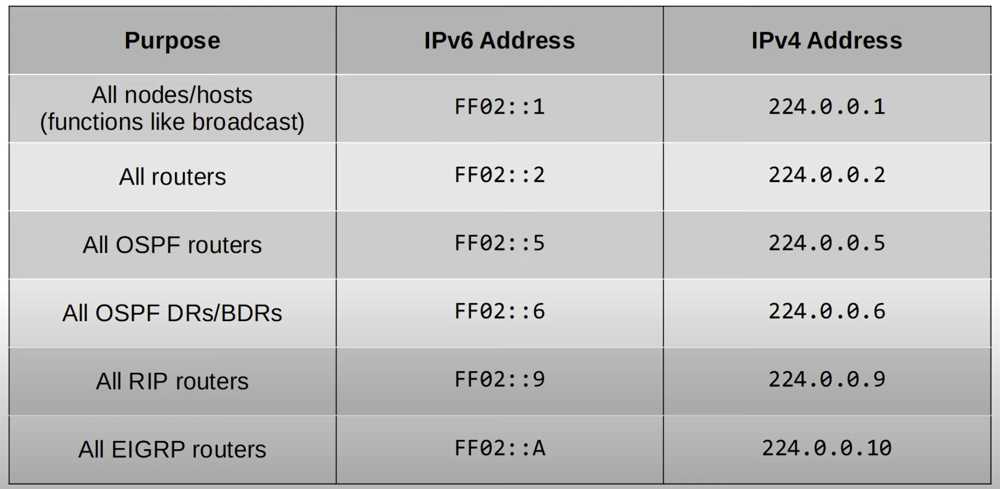
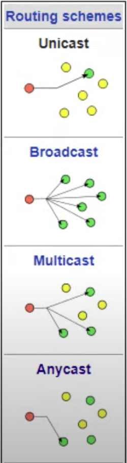

# CCNA Part 32

## IPv6 Part 2

### Agenda

* IPv6 address configuration(cont.)

    * Modified EUI-64

* IPv6 address types

    * Global unicast

    * Unique local

    * Link local

    * Multicast

    * Anycast

#### IPv6 Config

* EUI stand for Extended Unique Indentifier.

* Modified EUI-64 is a method of converting MAC address(48 bits) into a 64-bit interface identifier.

* This interface identifier can then become the host portion of a /64 IPv6 address.

* How to convert the MAC address:

    * Divide MAC address in half

    * Insert FFFE in the middle

    * Invert the 7th bit

    * EX.

        * 1234 5678 90AB -> 1234 56 | 78 90AB

        * 1234 56FF FE78 90AB

        * 1034 56FF FE78 90AB

        * 782B CBAC 0867 -> 7A2B CBFF FEAC 0867

        * 0200 4C4F 4F50 -> 0000 4CFF FE4F 4F50

        * 0050 56C0 0001 -> 0250 56FF FEC0 0001

        * 00FF 6BA6 F456 -> 02FF 6BFF FEA6 F456

        * 96AB 6D6B 98AE -> 94AB 6DFF FE6B 98AE

* Why invert the 7th bit:

    * MAC addresses can be divided into two types:

        * UAA(Universally Administred Address): Uniquely assigned to the device by the manufacturer.

        * LAA(Locally Administered Address): Manually assigned by an admin(with the mac-address command on the interface) or protocol. Doesnt have to be globally unique.

    * You can identify a UAA or LAA by the 7th bit of the MAC address, called the U/L bit(Universal/Local bit):

        * U/L = 0 -> UAA

        * U/L = 1 -> LAA

    * In the context of the IPv6 addresses/EUI-64, the meaning of the U/L bit is reversed:
        
        * U/L = 1 -> UAA

        * U/L = 0 -> LAA

#### Global Unicast Addresses

* Global unicast IPv6 addresses are public addresses which can be used over the internet.

* Must register to use them. Because they are public addresses, it is expected that they are globbaly unique.

* Originally defined as the `2000::/3` block(`2000::` to `3FFF:FFFF:FFFF:FFFF:FFFF:FFFF:FFFF:FFFF`).

* Now defined as all addresses which arent reserved for other purposes.

* IPv6 Global Unicast address:

    * 48-bit 'global routing prefix' assigned by the ISP.

    * 16-bit 'sub identifier', used by the enterprise to make various subnets.

    * 64-bit 'interface identifier', the host portion of the address.

#### Unique Local Addresses

* Unique local IPv6 addresses are private addresses which cannot be used over the internet.

* You do not need to register to use them. They can be used freely within internal networks and dont need to be globally unique(*). Cant be routed over the internet.

* Uses address block `FC00::/7` (`FC00::` to `FDFF:FFFF:FFFF:FFFF:FFFF:FFFF:FFFF:FFFF`).

* However, a later update requires the 8th not to be set to 1, so thee first two digits must be FD.

* IPv6 Unique Local Address

    * 2-bit indicates a unique local address.

    * 40-bits 'global id' which should be randomly generated.

    * 16-bit 'subnet identifier', used by enterprice to make various subnets.

    * 64-bit 'interface identifier', the host portion of the address.

#### Link Local Addresses

* IPv6 addresses are automatically generated on IPv6-enabled interfaces.

* Use command `ipv6 enable` on an interface to enable IPv6 on an interface.

* Uses the address block `FE80::/10` (`FE80::` to `FEBF:FFFF:FFFF:FFFF:FFFF:FFFF:FFFF:FFFF`).

* However the standart states that the 54 bits after FE80/10 should be all 0, so you wont see link local addresses begining with FE9, FEA, FEB, Onlt FE8.

* The interface ID is generated using EUI-64 rules.

* Link -local means that these addresses are used for communication with a single link(subnet). Routers will not route packets with a link-local destination IPv6 address.

* Common uses of link-local addresses:

    * Routing protocol peering(OSPFv3 uses link-local addresses for neighbor adjecencies).

    * next-hop addresses for static routes.

    * Neighbor Discovery Protocol(NDP, IPv6's replecemnt for ARP) uses link-local addresses to function.

#### Multicast Addresses

* Unicast addressea are one to one

    * one source one dest.

* Broadcast addresses are one to all

    * One source to who subnet.

* Multicast addresses are one to many.

    * One source to multiple destinations

* IPv6 uses range FF00::/8 for multicast. (`FF00::` to `FFFF:FFFF:FFFF:FFFF:FFFF:FFFF:FFFF:FFFF`).

* IPv6 doesnt use broadcast

* Scopes:

    * IPv6 defines multiple Mulicast 'scopes' which indicate how far the packet should be forwarded.

    * The addresses in the previous slide all use the link-local scope,which stay in the local subnet.

    * IPv6 multicast scopes:

        * Interface-local(FF01): The packet doesn't leave the local device. Can be used to send traffic to a service within the local device.

        * Link-local(FF02): The packet remain in the local subnet. Routers will not not route the packet between subnets.

        * Site-local(FF05): The packet can be forwarded by routers. Should be limited to a single physical location(not forwared over a WAN)

        * Organization-local(FF08): Wider in scope than site-local(an entire company/granization).

        * Global(FF0E):No boundries. Possible to be routed over Internet.

* Anycast addresses

    * Anycast is a new feature of IPv6.

    * Anycast is 'one-to-one-of-many'

* Multiple routers are configured with the same IPv6 address.

    * They use a routing protocol to advertise the address.
    
    * When Hosts send packets to that destination address, routers will forward it to the nearest router configured with that IP address

* There is no specific address range for anycast addresses. Use a regular unicast address(global unicast, unique local) and specify it as an anycast address

---

* `::` = The unspecified IPv6 address

    * Can be used when a device doesnt know its IPv6 address
    * deafult routes are configured to `::/0`

* `::1` = loopback address

    * Used to test the protocol stack on the local device.

    * Messages sent to this address are processed within the local device, but not sent to other devices.
